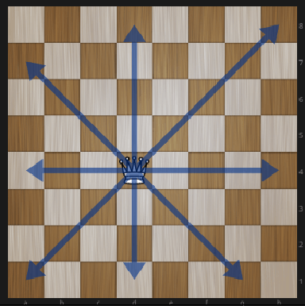

<<<<<<< HEAD
***Amasty Test PHP
Задание 1
=======
# Amasty Test PHP
## Задание 1
>>>>>>> efc6f4ef06f9ab91988d664f801524ca808d797f

#Нужно:
-	Создать интерфейс IChessmen, который содержит методы move, getPosition.
-	Создать абстрактный класс AbstractChessmen, который наследует интерфейс IChessmen, имеет свойство $x,$y, реализует функцию getPosition. 
-	Создать класс King, который наследует AbstractChessmen и реализует метод Move. Реализация метода Move должна бросать исключение, если фигуру перемещают на недопустимую область(смотрите рис. 1) . Так же нельзя переместить фигуру за край шахматной доски. Функция Move должна быть единственной возможностью изменить положение фигуры.
-	Создать класс Queen, который наследует AbstractChessmen и реализует метод Move. Реализация метода Move должна бросать исключение, если фигуру перемещают на недопустимую область(смотрите рис. 2) . Так же нельзя переместить фигуру за край шахматной доски. Функция Move должна быть единственной возможностью изменить положение фигуры.
-	Создать две фигуры Queen на х=1 y=1, King на x=4,y=3.
-	Переместите фигуру Queen на х=7 y=3, а King на x=2,y=2.
-	Выведите на экран позицию этих двух фигур.

(рис 1)->(рис 2)
